## Portfolio

---

### Research Projects

[Ontology-Based Mobile Application For Inorganic Chemistry (CHEMIQUE)](https://github.com/yazyazz/ChemiqueCOM3D/)
  
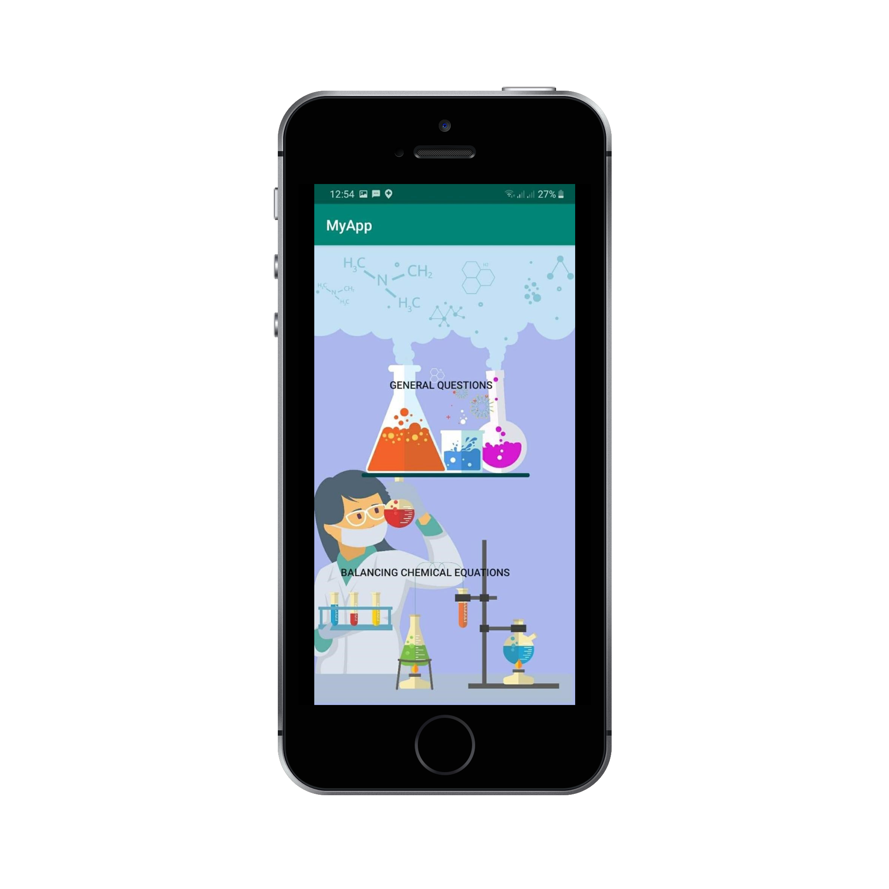  

[Filteria](https://github.com/yazyazz/Cat-Filteria/)
  
...                         |  ...
:-------------------------:|:-------------------------:
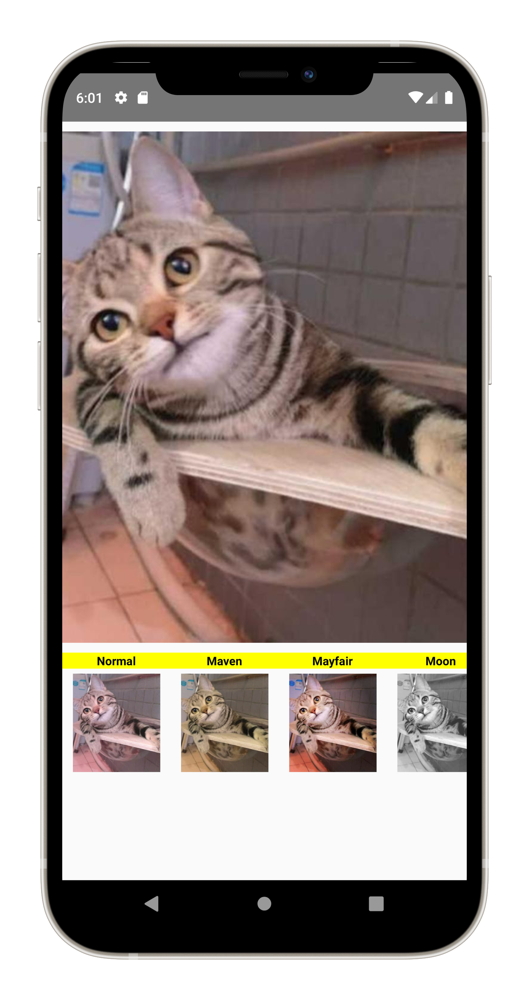  |  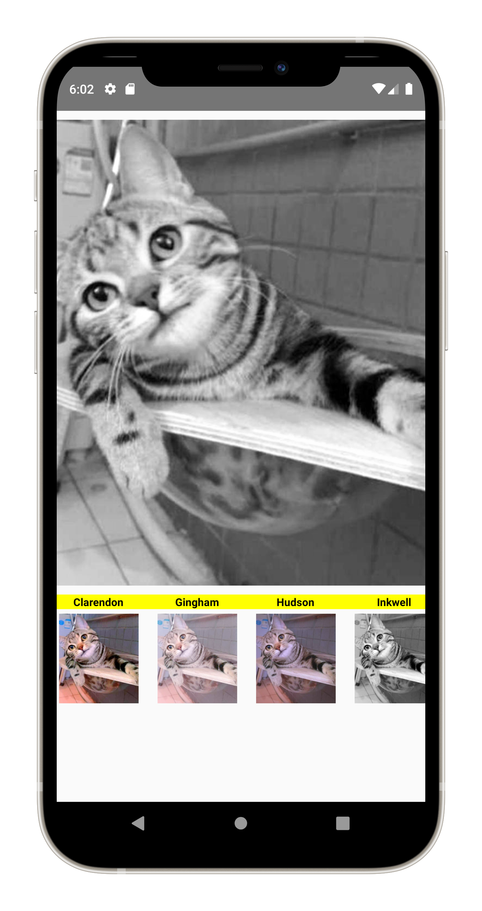

[Buiding visualizer](https://github.com/yazyazz/Mood_Beatz/)
  
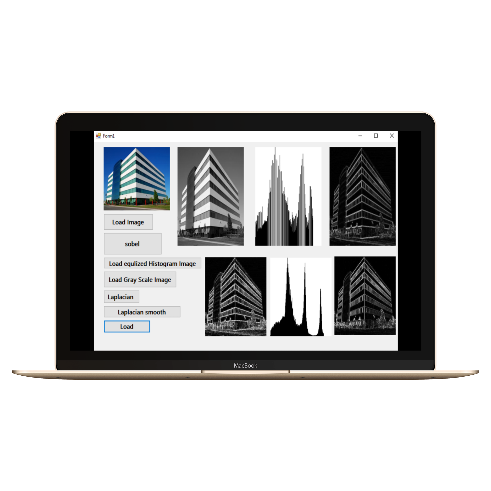

[Artino](https://github.com/yazyazz/Artwork_App/)
  
...                         |  ...
:-------------------------:|:-------------------------:
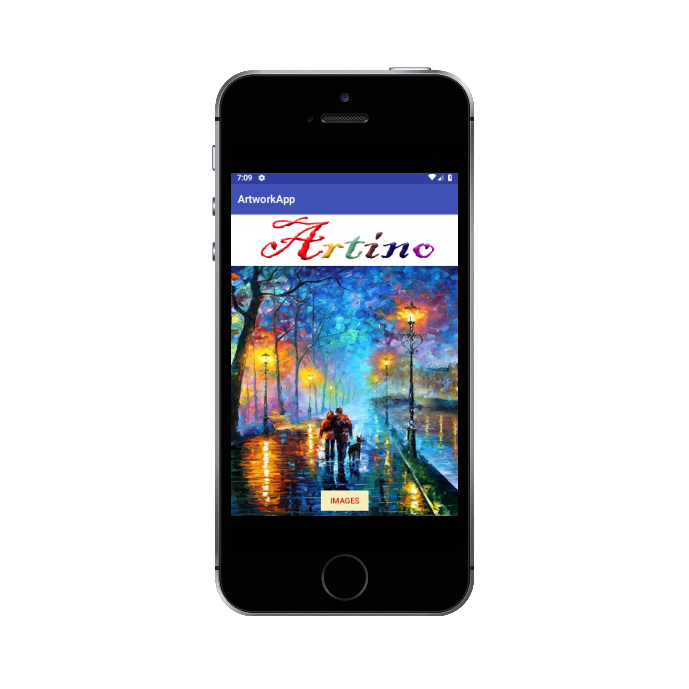  |  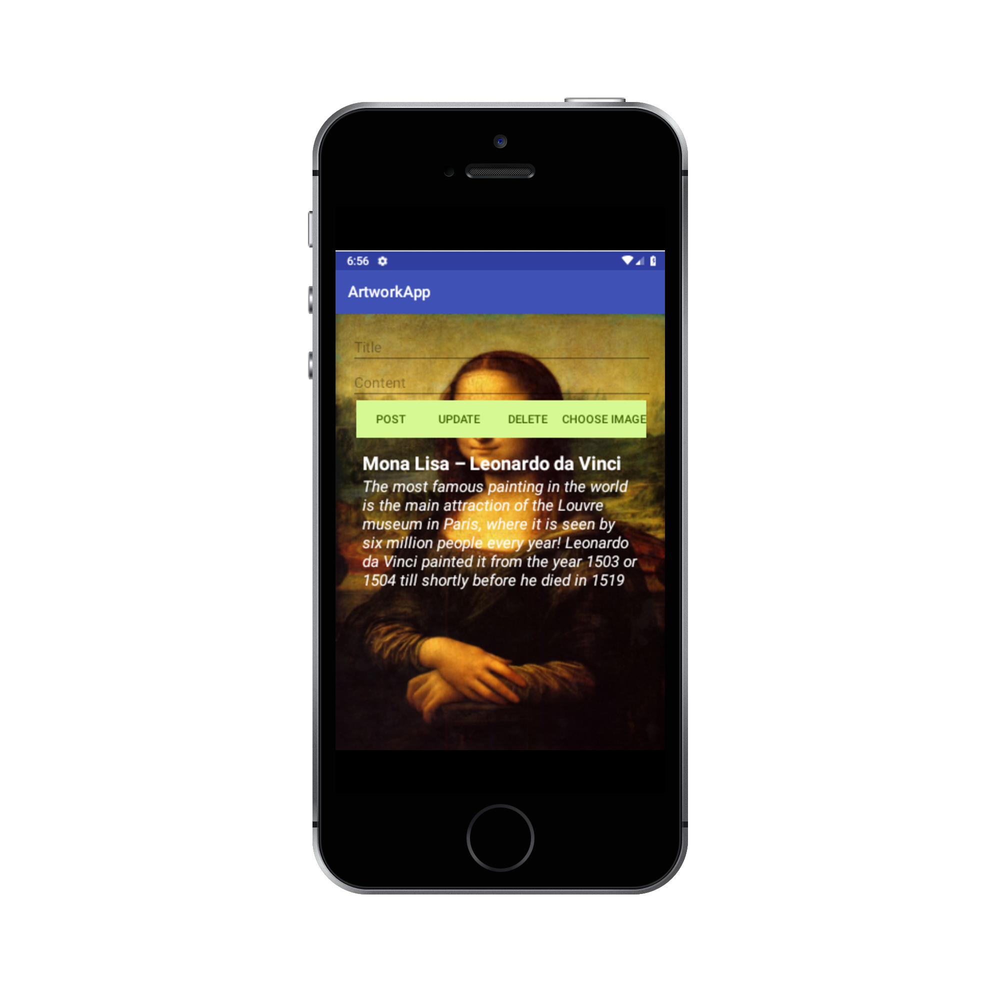

[Recycle Me](https://github.com/yazyazz/RecycleMe/)

 ...                         |  ...
:-------------------------:|:-------------------------:
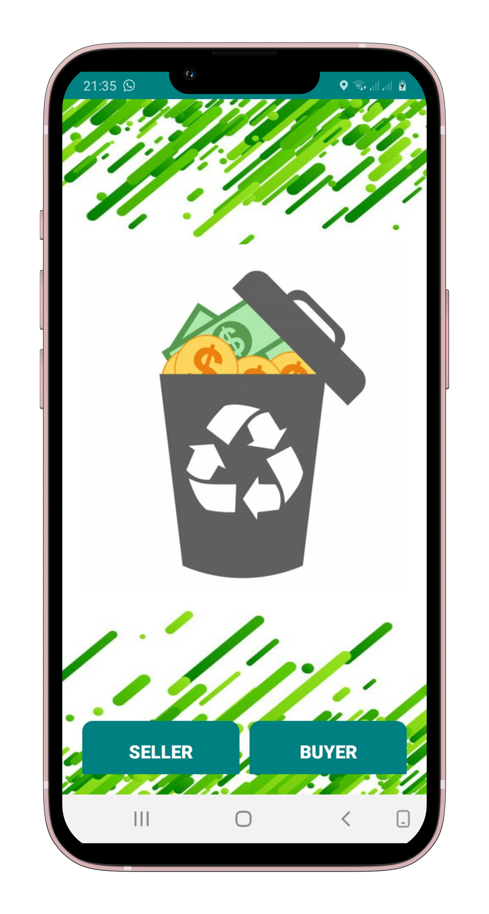|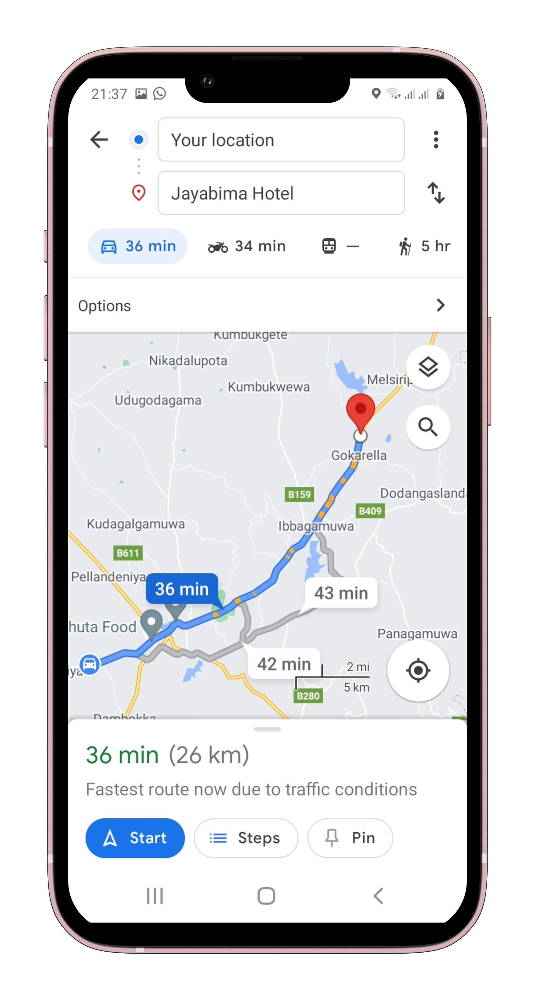

### Other Projects

- [Helaviru](https://play.google.com/store/apps/details?id=com.helavirufarmermobi&hl=en_CA&gl=US/)

...                         |  ...
:-------------------------:|:-------------------------:
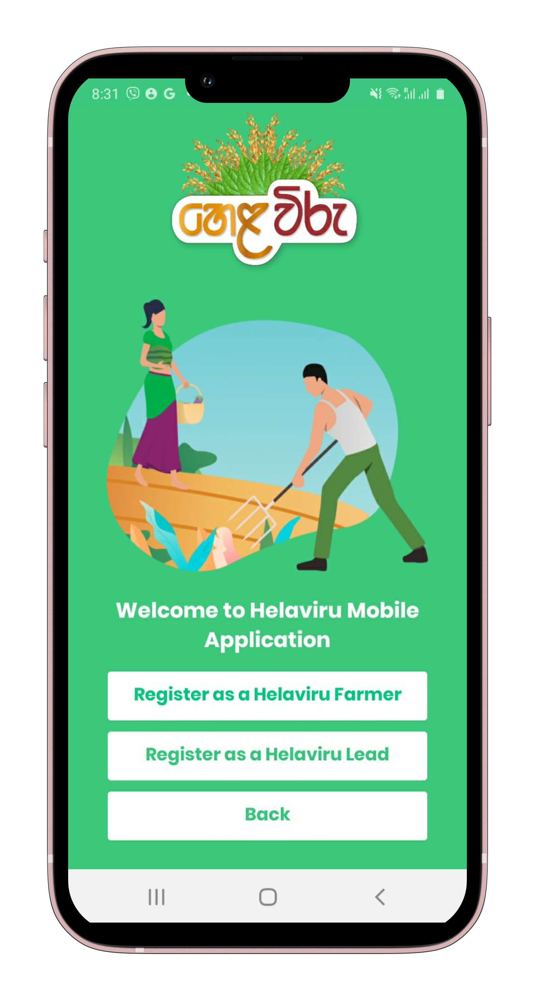  |  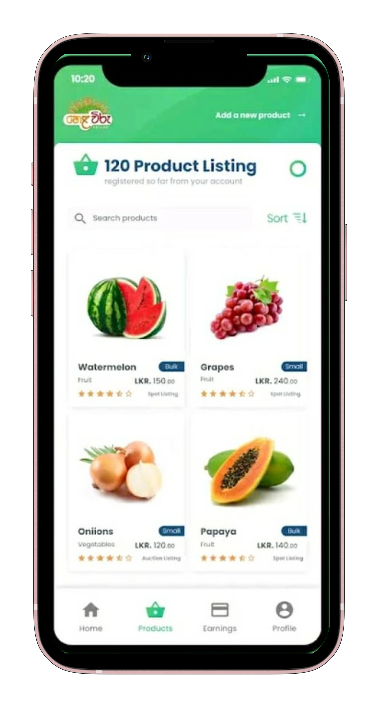

...                         |  ...
:-------------------------:|:-------------------------:
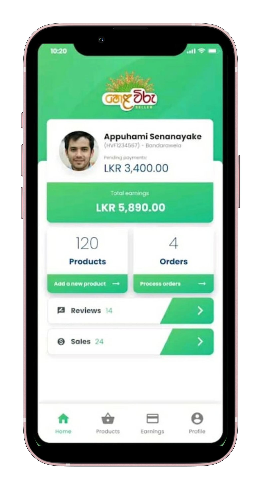  |  

- [Riyaviru](https://play.google.com/store/apps/details?id=com.riyaviru&hl=en_CA&gl=US/)

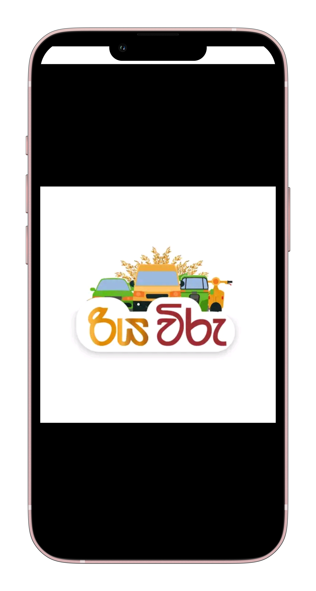

- [SLT_VFM](https://sri-lanka-telecom-wfm.soft112.com//)

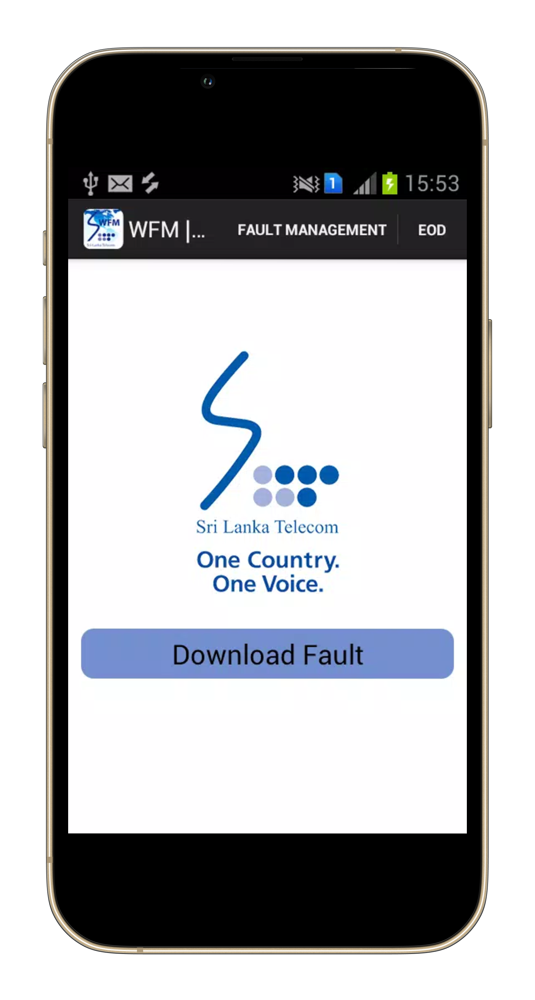

- [NMRA](https://play.google.com/store/apps/details?id=com.helavirufarmermobi&hl=en_CA&gl=US/)

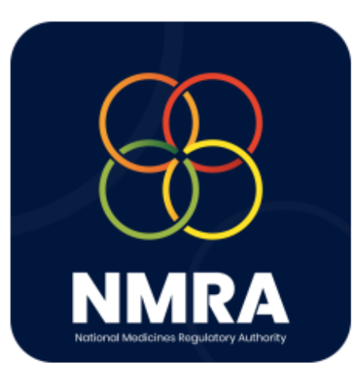

