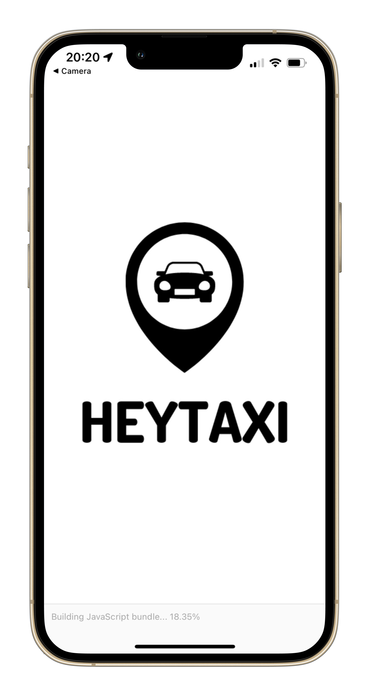
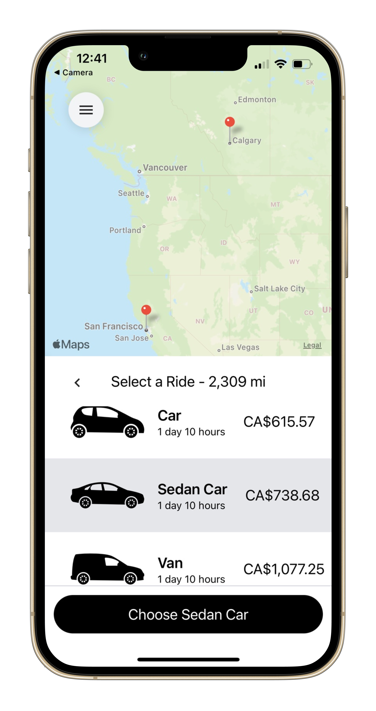
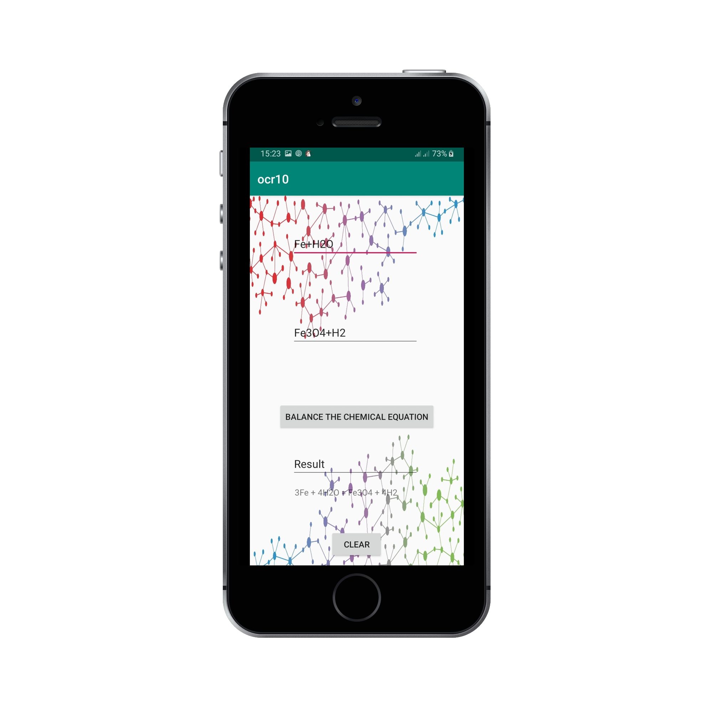
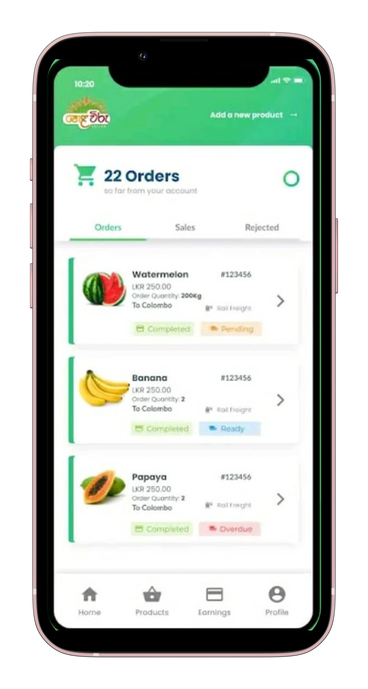
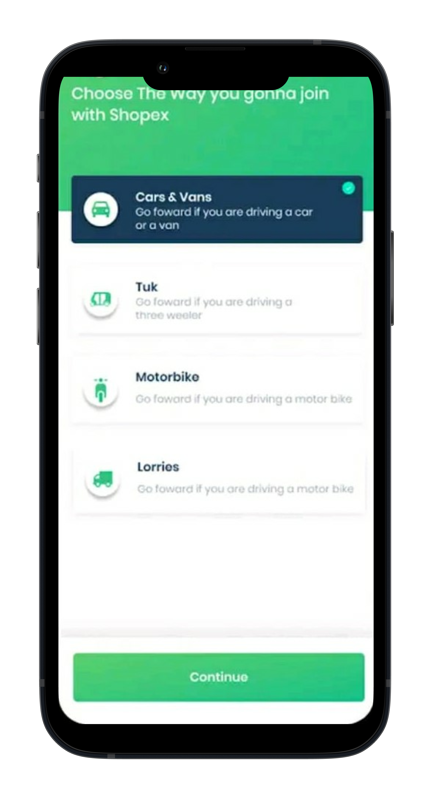
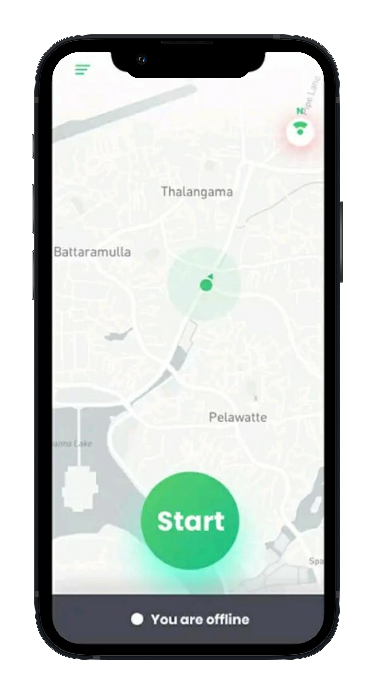

## Welcome to My Portfolio. 

---

## Skills

- Programming Languages : JavaScript(js), TypeScript, Java, Python, C, C++, C#, Racket.
- Mobile Technologies : React Native, Android, Flutter,  iOS.
- Framework/Libraries : ReactJS, Redux, Flux, NodeJS, Angular, Webpack, Babel, GraphQL.
- Front end : HTML5, CSS/SCSS, Material UI, Bootstrap, Ant Design, NativeBase, XML, XAML.
- Testing : Mocha, Junit, Jest, Selenium.
- Database : MySQL, PostgreSQL, MongoDB, NoSQL.
- Cloud Infrastructure : AWS, Microsoft Azure, Google Firebase.
- DevOps and Microservices : AWS, Heroku, Docker, Kubernetes, Jenkins, CI / CD.
- Version Control System: Git, SVN, Gitlab, Bitbucket.
- IDE : Eclipse, NetBeans, Sublime, VS code, PyCharm, Microsoft Excel, Word, PowerPoint.
- Design : UI / UX and responsive design, Figma, Processing, Adobe photoshop, Premiere Pro.
- Process : Object Oriented Design/OOPs, Distributed system design/architecture, Scrum, Kanban, Agile development, Problem solving, Gaming (Unreal  engine, CryEngine).
- Personal Skills : Interpersonal skills, Content writing, Leadership skills.

  
  ------
  
  
## Projects

###  [HeyTaxi](https://github.com/yazyazz/Hey-Taxi/)

Taxi Reservation App which allows users to reserve a vehicle based on their starting location and destination. HeyTaxi app uses Google Maps API and Google Autocomplete to provide a better service to the end user in a reliable way.

Technologies: React Native, Redux, Tailwind CSS, Google Maps API, Google Autocomplete.

...                         |  ...                       |        ...
:-------------------------:|:-------------------------:|:------------------------
||  

###  [Recycle Me](https://github.com/yazyazz/RecycleMe/)
 
 Non-biological waste collector is a mobile application that coordinates the vendors of these waste items
 and as well as customers who provide waste items and prediction of the amount of waste that would be collected from specific areas. 
 
 Technologies: Android, Java, Firebase, Linear Regression Algorithm, Python.
 
 ...                         |  ...
:-------------------------:|:-------------------------:
|

 
###  [Ontology-Based Application For Inorganic Chemistry (CHEMIQUE)](https://github.com/yazyazz/ChemiqueCOM3D/)

An android application that allows the user to perform basic chemical bonding, inorganic chemical reactions, and get a three-dimensional view of chemical bonds and resultants of chemical reactions and chemical equation balancing. The additional section which contains basic inorganic chemistry questions and answers will allow the user to evaluate their knowledge on the subject.

Technologies: Python, Flask, REST, Android, Spring Boot, Machine Learning, Image Processing(OCR).

Whitepaper: https://bit.ly/3dwOGac
  
...                         |  ...
:-------------------------:|:-------------------------:
       |       

###  [Helaviru](https://play.google.com/store/apps/details?id=com.helavirufarmermobi&hl=en_CA&gl=US/)

Cloud-based Digital Marketplace that facilitates trading activities of Agro-Produce and commodities.

Technologies: React Native, REST API, Spring MVC.

...                         |  ...
:-------------------------:|:-------------------------:
  |  

...                         |  ...
:-------------------------:|:-------------------------:
  |  

###  [Riyaviru](https://play.google.com/store/apps/details?id=com.riyaviru&hl=en_CA&gl=US/)

Riyaviru Delivery App is designed for the riders who wish to register and contribute for the Helaviru Agro-commodities platform as delivery riders by simply registering via the Riyaviru App. Riders could earn money by delivering goods using their own vehicle across Sri Lanka.

Technologies: React Native, REST API.

...                         |  ...                       |        ...
:-------------------------:|:-------------------------:|:------------------------
||  

###  [Filteria](https://github.com/yazyazz/Cat-Filteria/)

Different filters are applied to an image on the top when the user selects a filter from the horizontal scroll list below in the app.

Technologies: React native, Image Processing.
  
...                         |  ...
:-------------------------:|:-------------------------:
  |  

###  [Buiding visualizer](https://github.com/yazyazz/hispro/)

A Visulizer to detect vertexes, edges column wise and row wise and other image processing manipulations used in planning phase of construction of commercial buildings.

Technologies : C#, .NET.

### [Artino](https://github.com/yazyazz/Artwork_App/)

Making an interactive android application in the theme of artworks where users can get information about artworks.

Technologies: Android, Java, Firebase.

...                         |  ...                       
:-------------------------:|:-------------------------:|
|| 

