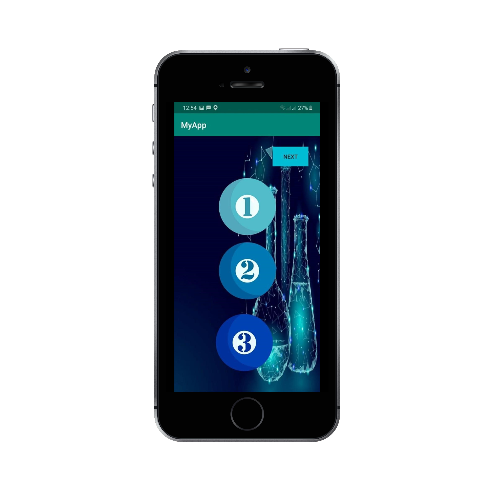
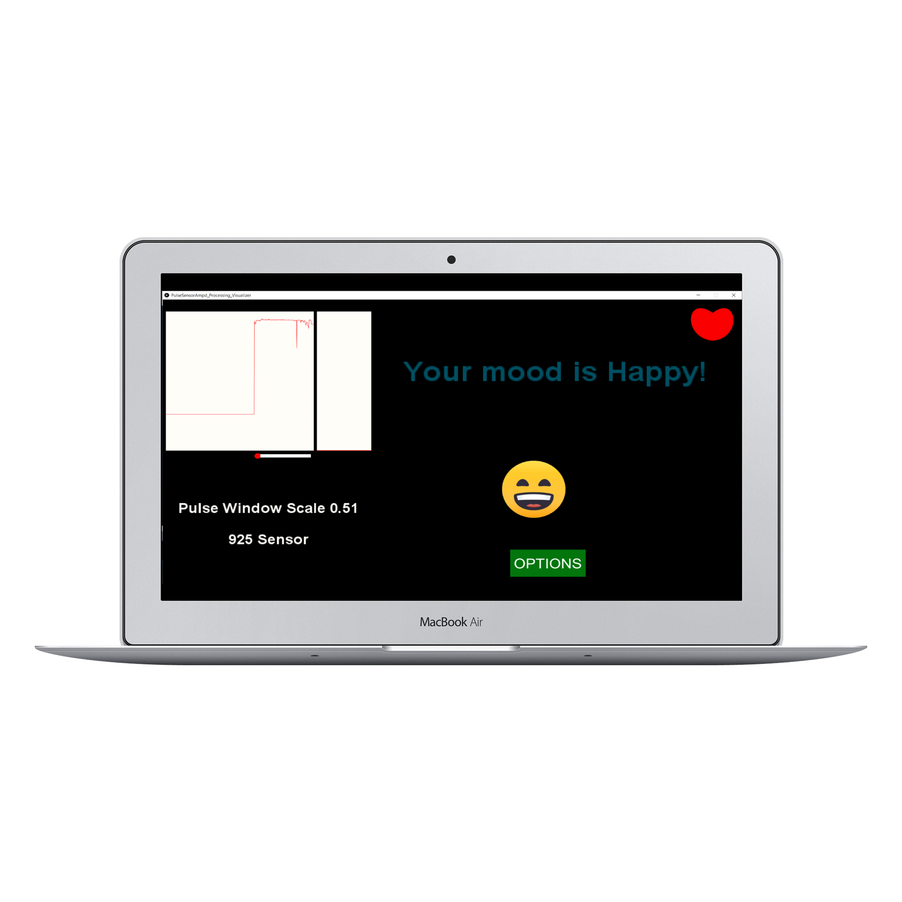

## Portfolio

---

### Research Projects

[Ontology-Based Mobile Application For Inorganic Chemistry (CHEMIQUE)](https://github.com/yazyazz/ChemiqueCOM3D/)
  

...                         |  ...
:-------------------------:|:-------------------------:
  |  

---
[Cat Filteria](https://github.com/yazyazz/Cat-Filteria/)
  

...                         |  ...
:-------------------------:|:-------------------------:
  |  

---
[Mood Beatz](https://github.com/yazyazz/Mood_Beatz/)
  

...                         |  ...
:-------------------------:|:-------------------------:
  |  
---

### Category Name 2

- [Project 1 Title](http://example.com/)
- [Project 2 Title](http://example.com/)
- [Project 3 Title](http://example.com/)
- [Project 4 Title](http://example.com/)
- [Project 5 Title](http://example.com/)

---

---

Page template forked from <a href="https://github.com/evanca/quick-portfolio">evanca</a>

<!-- Remove above link if you don't want to attibute -->
